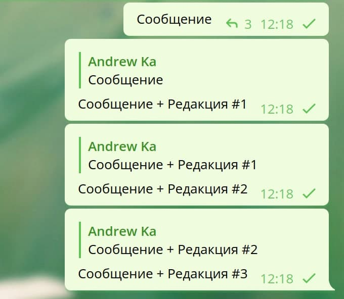
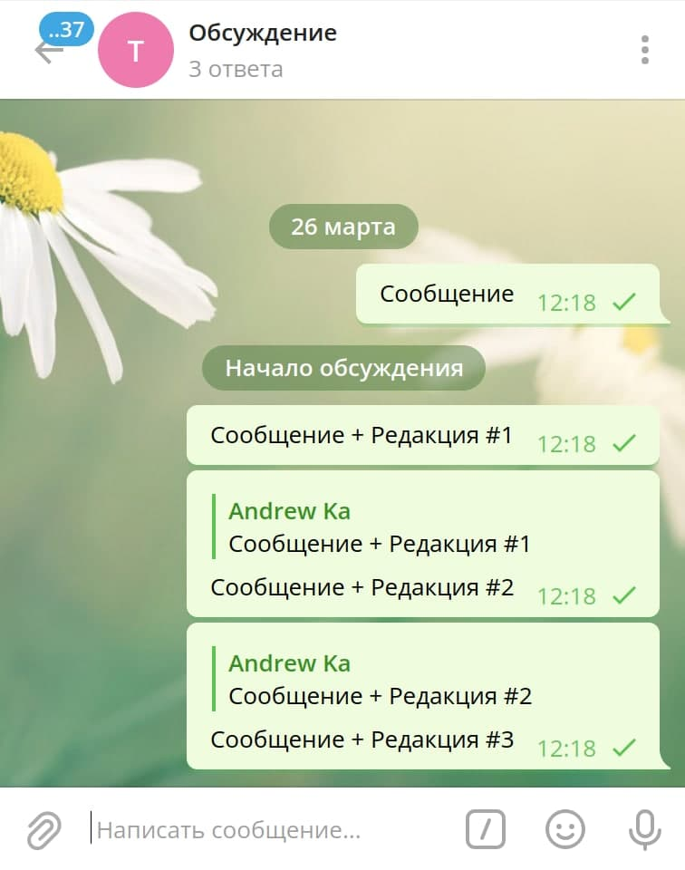

# budva32

Telegram messaging forward bot

These instructions will get you a copy of the project up and running on your local machine for development and testing purposes. See deployment for notes on how to deploy the project on a live system.

What things you need to install the software and how to install them

```commandline
docker build -t comerc/budva32:latest .
docker run -it -p 9000:9000 --name budva32 comerc/budva32:latest
```

A step by step series of examples that tell you how to get a development env running

Say what the step will be

```
Give the example
```

And repeat

```
until finished
```

End with an example of getting some data out of the system or using it for a little demo

Explain how to run the automated tests for this system

Explain what these tests test and why

```
Give an example
```

Explain what these tests test and why

```
Give an example
```

Add additional notes about how to deploy this on a live system

- [Dropwizard](http://www.dropwizard.io/1.0.2/docs/) - The web framework used
- [Maven](https://maven.apache.org/) - Dependency Management
- [ROME](https://rometools.github.io/rome/) - Used to generate RSS Feeds

Please read [CONTRIBUTING.md](https://gist.github.com/PurpleBooth/b24679402957c63ec426) for details on our code of conduct, and the process for submitting pull requests to us.

We use for versioning. For the versions available, see the [tags on this repository](https://github.com/your/project/tags).

- **Billie Thompson** - _Initial work_ - [PurpleBooth](https://github.com/PurpleBooth)

See also the list of [contributors](https://github.com/your/project/contributors) who participated in this project.

This project is licensed under the MIT License - see the [LICENSE](LICENSE) file for details

- Hat tip to anyone whose code was used
- Inspiration
- etc

Inspired by https://github.com/marperia/fwdbot

## How to install tdlib

For Ubuntu 18.04

```
$ sudo apt-get install build-essential gperf ccache zlib1g-dev libssl-dev libreadline-dev
```

Or use [TDLib build instructions](https://tdlib.github.io/td/build.html)

## Examples

```go
func getMessageLink(tdlibClient *client.Client, ChatId, MessageId int64) {
	messageLink, err := tdlibClient.GetMessageLink(&client.GetMessageLinkRequest{
		ChatId:     ChatId,
		MessageId:  MessageId,
		ForAlbum:   false,
		ForComment: false,
	})
	fmt.Println("****")
	if err != nil {
		fmt.Println(err)
	} else {
		fmt.Printf("%#v\n", messageLink)
	}
}

// How to use update?

	for update := range listener.Updates {
		if update.GetClass() == client.ClassUpdate {
			if updateNewMessage, ok := update.(*client.UpdateNewMessage); ok {
				//
			}
		}
	}

// etc
// https://github.com/zelenin/go-tdlib/blob/ec36320d03ff5c891bb45be1c14317c195eeadb9/client/type.go#L1028-L1108

// How to use markdown?

	formattedText, err := tdlibClient.ParseTextEntities(&client.ParseTextEntitiesRequest{
		Text: "*bold* _italic_ `code`",
		ParseMode: &client.TextParseModeMarkdown{
			Version: 2,
		},
	})
	if err != nil {
		log.Print(err)
	} else {
		log.Printf("%#v", formattedText)
	}

```

## Use ReplyToMessageId

До боли простое решение по копированию сообщений с историей изменений. Если копируемое сообщение было отредактировано, то копирование выполняется в новое сообщение с отсылкой на предыдущее, благодаря механизму ответов.



И можно получить отдельно всю историю в просмотре ответов (работает только для группы, но не для канала).



## config.yml example

```yml
PhoneNumber: '78901234567'
Forwards:
  - From: -1234
    To: [-4321]
    Exclude: 'Крамер|#УТРЕННИЙ_ОБЗОР'
    Include: '#ARK|#Идеи_покупок|#ОТЧЕТЫ'
    IncludeSubmatch:
      - Regexp: '(^|[^A-Z])\$([A-Z]+)'
        Group: 2
        Match: ['F', 'GM', 'TSLA']
```
