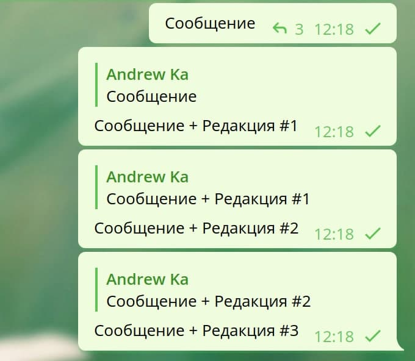
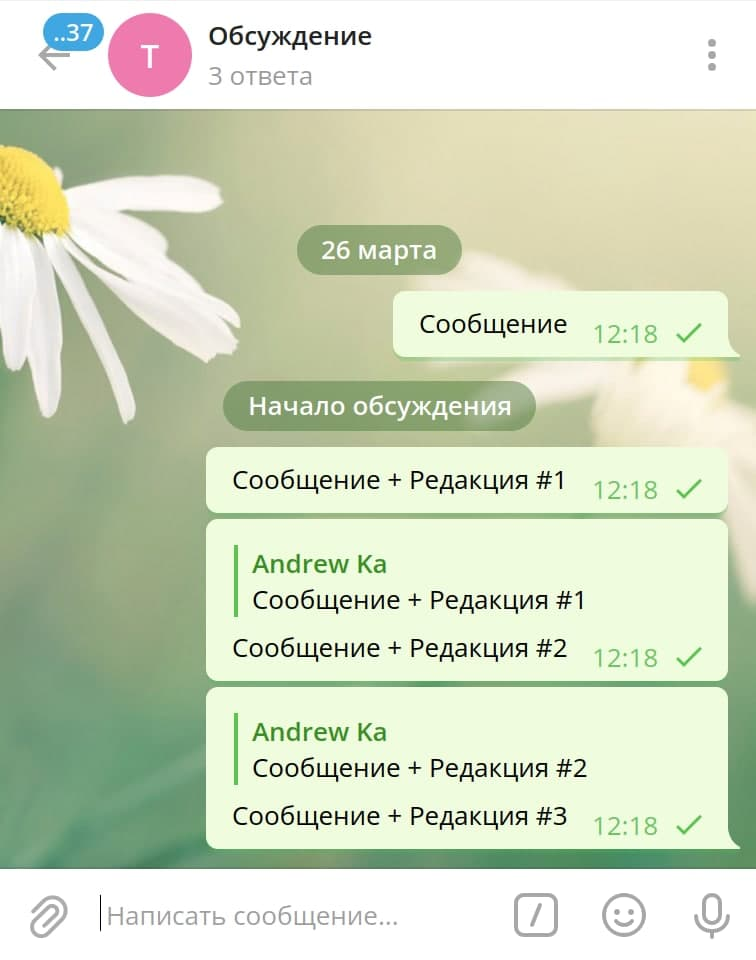

# budva32

Telegram-Forwarder (UNIX-way)

## How to install tdlib (for use w/o docker)

For Ubuntu 18.04

```
$ sudo apt-get install build-essential gperf ccache zlib1g-dev libssl-dev libreadline-dev
```

Or use [TDLib build instructions](https://tdlib.github.io/td/build.html)

## First start for auth

from console:

```
$ go run .
```

or via docker:

```
$ make
$ make up
$ docker attach telegram-forwarder
```

but then we have problem with permissions (may be need docker rootless mode?):

```
$ sudo chmod -R 777 ./data
```

## config.yml example

```yml
Accounts:
	-	PhoneNumber: '71112223344'
		Forwards:
			- From: -2222
				To: [-1111]
	-	PhoneNumber: '78901234567'
		Forwards:
			- From: -1234
				To: [-4321, -8888]
				Exclude: 'Крамер|#УТРЕННИЙ_ОБЗОР'
				Include: '#ARK|#Идеи_покупок|#ОТЧЕТЫ'
				IncludeSubmatch:
					- Regexp: '(^|[^A-Z])\$([A-Z]+)'
						Group: 2
						Match: ['F', 'GM', 'TSLA']
```

## Get chat list with limit (optional)

http://localhost:4004?limit=10

## About ReplyToMessageId

До боли простое решение по копированию сообщений с историей изменений. Если копируемое сообщение было отредактировано, то копирование выполняется в новое сообщение с отсылкой на предыдущее, благодаря механизму ответов.



И можно получить отдельно всю историю в просмотре ответов (работает только для группы, но не для канала).



## Examples for go-tdlib

```go
func getMessageLink(tdlibClient *client.Client, ChatId, MessageId int64) {
	messageLink, err := tdlibClient.GetMessageLink(&client.GetMessageLinkRequest{
		ChatId:     ChatId,
		MessageId:  MessageId,
		ForAlbum:   false,
		ForComment: false,
	})
	fmt.Println("****")
	if err != nil {
		fmt.Println(err)
	} else {
		fmt.Printf("%#v\n", messageLink)
	}
}

// How to use update?

	for update := range listener.Updates {
		if update.GetClass() == client.ClassUpdate {
			if updateNewMessage, ok := update.(*client.UpdateNewMessage); ok {
				//
			}
		}
	}

// etc
// https://github.com/zelenin/go-tdlib/blob/ec36320d03ff5c891bb45be1c14317c195eeadb9/client/type.go#L1028-L1108

// How to use markdown?

	formattedText, err := tdlibClient.ParseTextEntities(&client.ParseTextEntitiesRequest{
		Text: "*bold* _italic_ `code`",
		ParseMode: &client.TextParseModeMarkdown{
			Version: 2,
		},
	})
	if err != nil {
		log.Print(err)
	} else {
		log.Printf("%#v", formattedText)
	}

```

## Inspired by

- https://github.com/marperia/fwdbot
- https://github.com/wcsiu/telegram-client-demo (article)[https://wcsiu.github.io/2020/12/26/create-a-telegram-client-in-go-with-docker.html]
- https://vc.ru/dev/158757-sozdanie-i-razvertyvanie-retranslyatora-telegram-kanalov-ispolzuya-python-i-heroku
